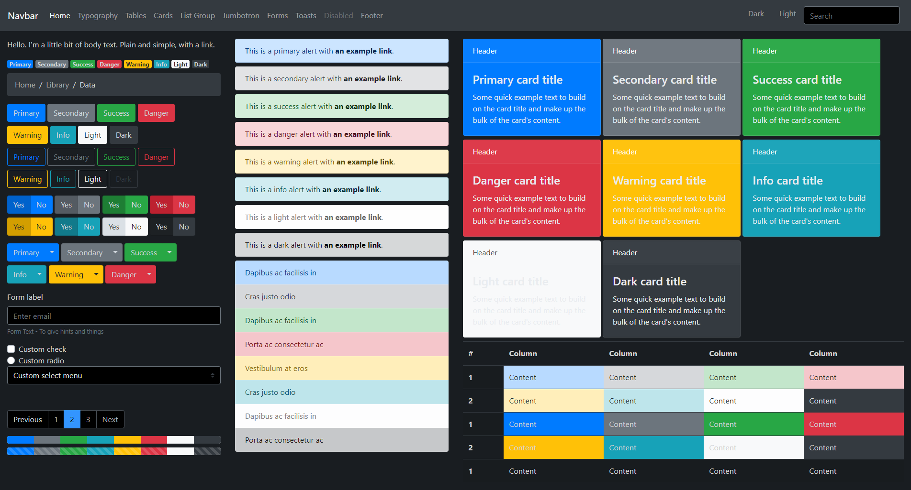
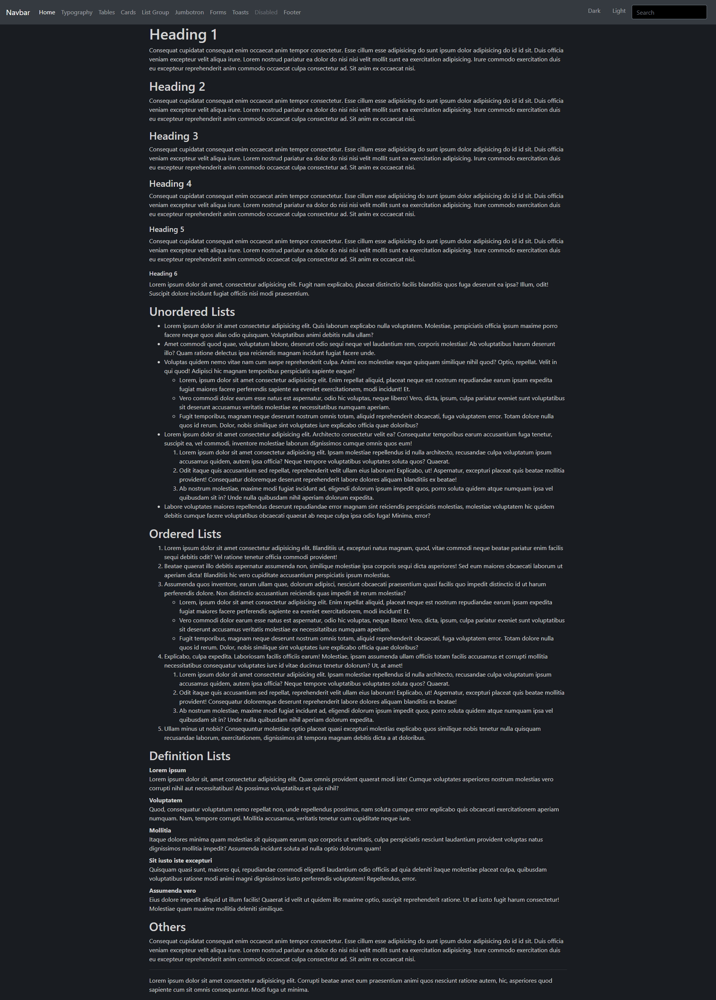
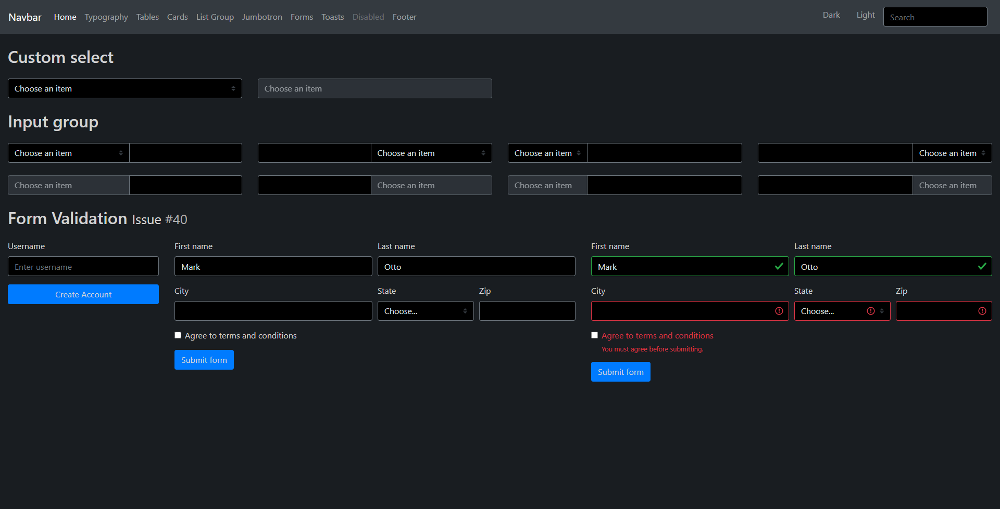
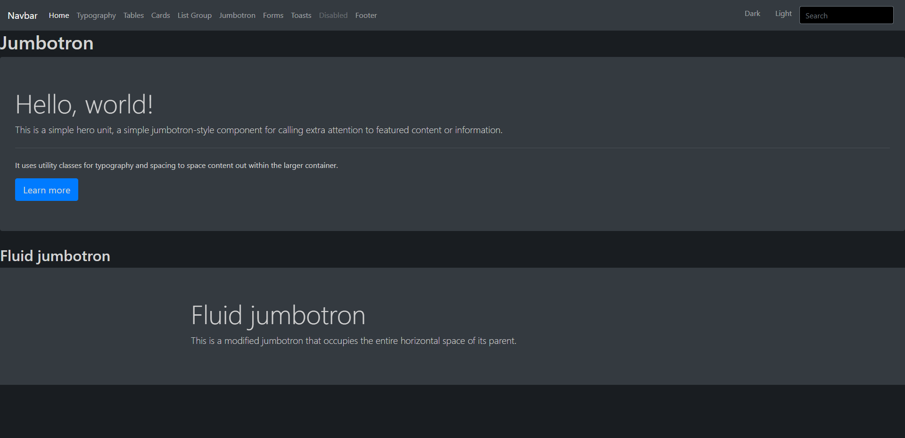
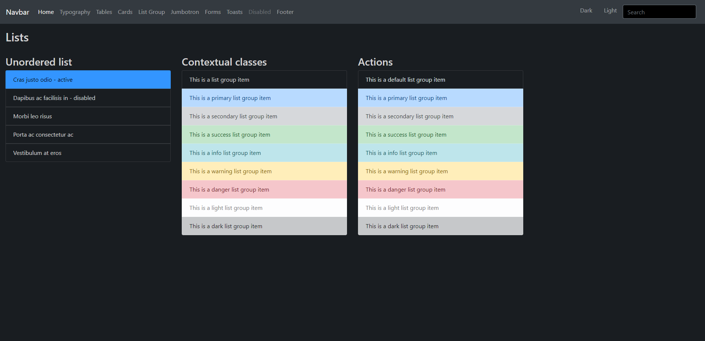
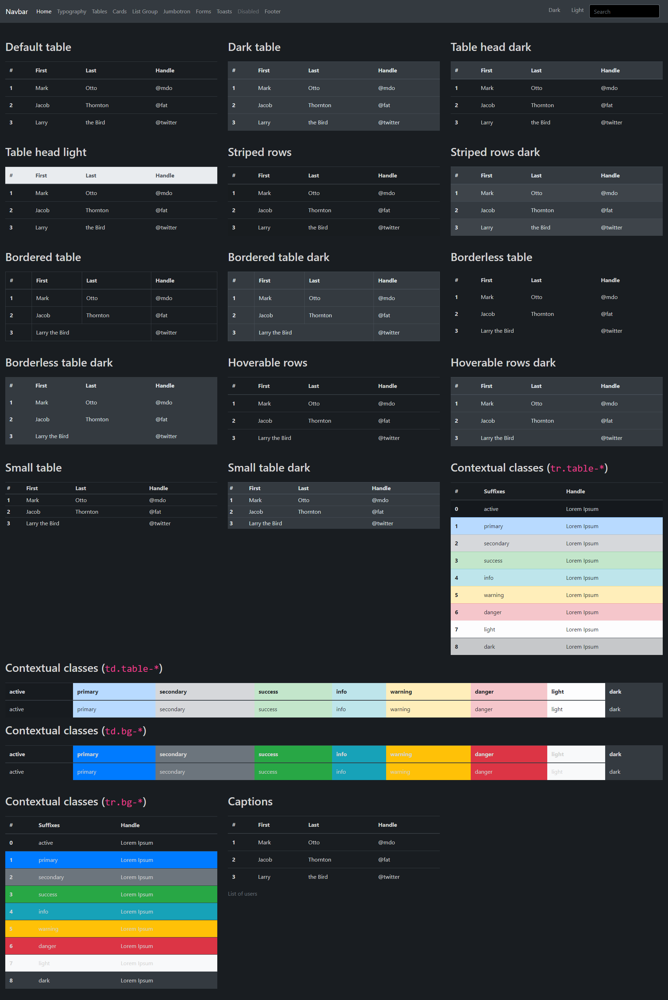
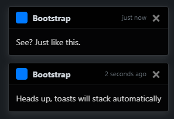
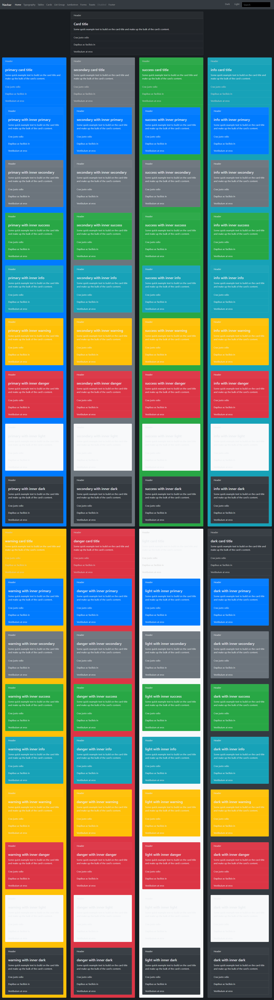

# Bootstrap 4 Dark theme

Bootstrap 4 dark theme that supports togging dark/light themes as well. There is no fluff, it changes the color of Bootstrap and that's it, no new thing to learn or unlearn, just Bootstrap, but Dark!

[](https://github.com/ForEvolve/bootstrap-dark/actions/workflows/main.yml)
[](https://www.npmjs.com/package/@forevolve/bootstrap-dark)

# Preview










# Versioning

SemVer is used to keep things easy for everyone.

# How to use

Official builds are available in the public npm registry.

```
npm install @forevolve/bootstrap-dark --save
```

The package contains the content of the `dist` directory which includes the Bootstrap JavaScript files, for convenience, and the Bootstrap Dark CSS files.
To load the dark theme, `<link>` the `bootstrap-dark.css` or the `bootstrap-dark.min.css` instead of the `bootstrap[.min].css` file. You can load the bundled JavaScript files, the original ones or the file from the CDN of your choosing.

**Example:**

```html
<link rel="stylesheet" href="/css/bootstrap-dark.min.css" />
```

## CDN

You can also load the files using [jsdelivr](jsdelivr.net) by following this pattern: `https://cdn.jsdelivr.net/npm/@forevolve/bootstrap-dark@{NPM PACKAGE VERSION}/dist/{PATH TO THE FILE}`.

Here is the preceding example using jsdelivr:

```html
<link rel="stylesheet" href="https://cdn.jsdelivr.net/npm/@forevolve/bootstrap-dark@1.0.0/dist/css/bootstrap-dark.min.css" />
```

## Dark/Light toggle

You can `<link>` both the `toggle-bootstrap.css` and the `toggle-bootstrap-dark.css` files to allow toggling the normal/dark theme based on your page body.

-   To display the original Bootstrap color, apply the `bootstrap` class on your body, like `<body class="bootstrap">`.
-   To display the Bootstrap Dark theme, apply the `bootstrap-dark` class on your body, like `<body class="bootstrap-dark">`.

If you want to support print, load the `toggle-bootstrap-print.css` or `toggle-bootstrap-print.min.css` file after the others.

**Example:**

```html
<link rel="stylesheet" href="/css/toggle-bootstrap.min.css" />
<link rel="stylesheet" href="/css/toggle-bootstrap-dark.min.css" />
<link rel="stylesheet" href="/css/toggle-bootstrap-print.min.css" />
```

**Using jsdelivr CDN:**

```html
<link rel="stylesheet" href="https://cdn.jsdelivr.net/npm/@forevolve/bootstrap-dark@1.0.0/dist/css/toggle-bootstrap.min.css" />
<link rel="stylesheet" href="https://cdn.jsdelivr.net/npm/@forevolve/bootstrap-dark@1.0.0/dist/css/toggle-bootstrap-dark.min.css" />
<link rel="stylesheet" href="https://cdn.jsdelivr.net/npm/@forevolve/bootstrap-dark@1.0.0/dist/css/toggle-bootstrap-print.min.css" />
```

Check out the samples app for more info about this feature.

## Themeable .navbar

When using the `toggle-*` stylesheets, you can create `.navbar` that uses the current theme. Light when `<body class="bootstrap">` and dark when `<body class="bootstrap-dark">`.

Example, instead of `navbar-light bg-light` or `navbar-dark bg-dark`, use `.navbar-themed`, like this:

```html
<nav class="navbar navbar-expand-lg navbar-themed">...</nav>
```

Check out the samples app for more info about this feature.

## prefers-color-scheme

From version 1.1, I added two new css files: `bootstrap-prefers-dark.css` and `bootstrap-prefers-light.css`.
Those two files use `prefers-color-scheme` media query instead of relying on a body's css class.
There is also a new `bootstrap-light.css` file that is bootstrap, plus the `.navbar-themed` light addon.

There is two possible combination:

-   default (no `prefers-color-scheme` specified or `prefers-color-scheme: light`): default bootstrap (light), `prefers-color-scheme: dark`: bootstrap dark
-   default (no `prefers-color-scheme` specified or `prefers-color-scheme: dark`): bootstrap dark, `prefers-color-scheme: light`: default bootstrap (light)

Here is an example for a **light default**:

```html
<link rel="stylesheet" href="https://cdn.jsdelivr.net/npm/@forevolve/bootstrap-dark@1.1.0/dist/css/bootstrap-light.min.css" />
<link rel="stylesheet" href="https://cdn.jsdelivr.net/npm/@forevolve/bootstrap-dark@1.1.0/dist/css/bootstrap-prefers-dark.min.css" />
```

See `./samples/html/prefers-dark-default-light.html` for a working example.

> Note that the _print css_ is included in `bootstrap-light.min.css`.

Here is an example for a **dark default**:

```html
<link rel="stylesheet" href="https://cdn.jsdelivr.net/npm/@forevolve/bootstrap-dark@1.1.0/dist/css/bootstrap-dark.min.css" />
<link rel="stylesheet" href="https://cdn.jsdelivr.net/npm/@forevolve/bootstrap-dark@1.1.0/dist/css/bootstrap-prefers-light.min.css" />
```

See `./samples/html/prefers-light-default-dark.html` for a working example.

> Note that the _print css_ is included in `bootstrap-dark.min.css`.

## bootstrap-${default}-prefers-${specific}.css

Added in version 1.2 (preview) and 2.0, the stylesheets `bootstrap-dark-prefers-light.css` and `bootstrap-light-prefers-dark.css` leverage the `prefers-color-scheme` CSS media query and allow a default color scheme followed by a preferred color scheme.

Technically, they are a combination of two CSS.
Their high-level structure looks like the following:

```css
/*
DEFAULT STYLES (including print styles):
bootstrap-light.css or bootstrap-dark.css
*/
@media (prefers-color-scheme: light|dark) {
    /*
    SPECIFIC COLOR STYLES:
    bootstrap-prefers-light-color-only.css or bootstrap-prefers-dark-color-only.css
    */
}
```

You can use these by loading one of them like this (ex.: default: light with dark support):

```html
<link rel="stylesheet" href="/dist/css/bootstrap-light-prefers-dark.min.css" />
```

> You can also use jsdelivr CDN.

```html
<!-- Bootstrap Dark by default with `prefers: light` support -->
<link rel="stylesheet" href="https://cdn.jsdelivr.net/npm/@forevolve/bootstrap-dark@2.0.0/dist/css/bootstrap-dark-prefers-light.min.css" />
<!-- OR -->
<!-- Bootstrap (Light) by default with `prefers: dark` support -->
<link rel="stylesheet" href="https://cdn.jsdelivr.net/npm/@forevolve/bootstrap-dark@2.0.0/dist/css/bootstrap-light-prefers-dark.min.css" />
```

# How to build

If you want to build the theme manually, modify it or even contribute, this section explains how.

## Prerequisites

1. You need `npm` to build this project; see [Node JS](https://nodejs.org/en/) for more info.
1. You need .NET Core 3.1+; see [.NET Core Downloads](https://www.microsoft.com/net/download/Windows/build) for more info.
    > You can also test using the HTML sample, but there are more pages in the .NET app.

## Getting started

1. Clone this repo
1. Run `npm install`
1. Go to the _samples/razor-pages_ directory (`cd samples/razor-pages`)
1. Run `dotnet restore`

## Starting the project

1. Run `dotnet run` (from the _samples/razor-pages_ directory) or if you are using VS Code, `Start Debugging` will work.
1. Run `npm run watch` in a second terminal

Once you started both server and the watch command, the `browser-sync` proxy should open in a browser at the following URI: `http://localhost:3000`.

## Other build info

There is a few npm and gulp scripts.

### npm scripts

1. `gulp-watch` simply runs `gulp watch`
1. `browser-sync-proxy` starts browsersync watching for any `wwwroot/css/*.css` changes
1. `watch` run both previous scripts in parallel

### gulp scripts

1. `build-theme` compile the theme to css.
1. `copy-dist-to-razor-pages` copy the content of the `dist` folder to `samples/razor-pages/wwwroot` (used by the Razor Pages).
1. `copy-dist-to-html` copy the content of the `dist` folder to `samples/html` (used by the HTML sample).
1. `copy-dist-to-samples` executes `copy-dist-to-html` and `copy-dist-to-razor-pages` in parallel.
1. `copy-bootstrap-js` copy the bootstrap js files to the `dist/js` directory.
1. `watch` execute `copy-bootstrap-js` then watch to rebuild the theme.
1. `default` runs `copy-bootstrap-js` and `build-theme` then `copy-dist-to-samples`.

# The project structure

-   `samples` is the samples folders.
-   `samples/html` is a plain HTML samples app.
-   `samples/razor-pages` is the ASP.NET Core application that is used to test the theme. This directory is not packaged.
    -   `Pages` are the ASP.NET Core Razor Pages. That's the preview.
        > **Why .NET Core?** Well, I wanted to script some loops, and I know .Net; so I picked Razor Pages to do just that: dynamic pages! Moreover, it is open source and cross-platform.
        >
        > If you think that something else would be better, feel free to open an issue about it; I would not mind switching to another technology (see the Contribute section below).
    -   `Services` are the web pages services; so far it's pretty thin.
    -   `wwwroot` are the web assets; the `dist` files are copied there.
-   `assets` are the project assets (like the screenshot in the readme file).
-   `dist` are the distributable files; if you want to copy/paste the files into your projects, that's the ones. They also include bootstrap JavaScript files, unaltered.
-   `scss` are the source theme files.
-   Other files (root): npm, license, readme, etc.

# Contribute

To contribute, start by opening an issue or reply on an existing issue so we can discuss your feature or bug to find the best way to approach it.

Once we settled on a strategy, you can then Fork/Code/Open a PR.

-   Please add yourself in the `package.json` `contributors` array.
-   Please keep PR focused on a single feature, it is easier for everyone this way and it helps keep the conversation focused. I way prefer multiple smaller PR than a single huge one.

Thanks in advance for your contribution.

See [Contributing to ForEvolve open source projects](https://github.com/ForEvolve/Toc/blob/master/CONTRIBUTING.md) and [Contributor Covenant Code of Conduct](https://github.com/ForEvolve/Toc/blob/master/CODE_OF_CONDUCT.md) for more information.

# Release notes

Since CI build numbers are automated, it is hard to know in advance what the next deployed build number will be, so the `(latest)` version represents that version.

## 4.0.0

-   Fix pre and code color, setting the `$pre-color` variable to `$gray-100`, overriding the default of `$gray-900` for the dark theme.

> No breaking changes expected. This version only change the code/pre color.
> The major bump is to override the pre-release package that I deprecated recently during the no abandonned PR #63.
> I was not able to delete the package on NPM, so this should fix the issue.

## 3.0.0

-   Fix an issue where dark colors were not taken into account because of the missing variable maps `$colors` and `$theme-colors`. This might be a breaking change.
-   Update `$yiq-text-dark` from `$gray-900` to `$gray-800` and `$yiq-text-light` from `$gray-400` to `$gray-200` so the text looks better with the updated color maps.

## 2.1.1

-   Bump Bootstrap to `4.6.2` (from `4.6.0`)

## 2.1.0

-   Add a Themed page in the sample app.
-   Add the following themed utilities that flip from dark to light depending on the theme:
    -   `.bg-themed` (dark: `.bg-dark` | Light: `.bg-light`)
    -   `.text-themed` (dark: `.text-light` | Light: `.text-dark`)
    -   `.alert-themed` (dark: `.alert-dark` | Light: `.alert-light`)
-   Add the following themed utilities (inverted colors) that flip from dark to light depending on the theme:
    -   `.bg-themed-inverted` (dark: `.bg-light` | Light: `.bg-dark`)
    -   `.text-themed-inverted` (dark: `.text-dark` | Light: `.text-light`)
    -   `.alert-themed-inverted` (dark: `.alert-light` | Light: `.alert-dark`)

## 2.0.0

-   Add `bootstrap-dark-prefers-light.css` which default to Bootstrap dark and display the light colors if the user's `prefers-color-scheme: light`.
-   Add `bootstrap-light-prefers-dark.css` which default to Bootstrap and display the dark colors if the user's `prefers-color-scheme: dark`.
-   Add `bootstrap-prefers-dark-color-only.css` which is only the colors of `bootstrap-prefers-dark.css`. This is autogenerated by `clean_non_color_attr.js`.
-   Add `bootstrap-prefers-light-color-only.css` which is only the colors of `bootstrap-prefers-light.css`. This is autogenerated by `clean_non_color_attr.js`.
-   Add `clean_non_color_attr.js` gulp plugin (based on `gulp-css-remove-attributes`).
-   Update .NET/Razor Pages sample to use these new CSS files.

> The preview versions 1.2.x was ¾ of this. We bumped the version due to the `$card-color` change (see below).

### Breaking changes

The `$card-color` variable has been reverted from `$gray-200` (`#e9ecef`) to `null` (default Bootstrap value) due to a color issue in the dark/light theme.

## 1.1.0

-   Update `bootstrap-dark.css` to include the `.navbar-themed` class (dark version).
-   Add `bootstrap-light.css` which is bootstrap plus the `.navbar-themed` class (light version).
-   Add `bootstrap-prefers-dark.[css|scss]` that is the equivalent of `bootstrap-dark.[css|scss]`, without the print, wrapped in a `@media (prefers-color-scheme: dark)` media query.
-   Add `bootstrap-prefers-light.[css|scss]` that is the equivalent of `bootstrap-light.[css|scss]`, without the print, wrapped in a `@media (prefers-color-scheme: light)` media query.
-   Add two samples to show this usage: `./samples/html/prefers-dark-default-light.html` and `./samples/html/prefers-light-default-dark.html`
-   Update .NET/Razor Pages sample to use these new CSS files.

## 1.0.0

-   Update to Bootstrap 4.6.0
-   Move the Razor Pages app to the `samples/razor-pages` directory
-   Add a new plain HTML app in the `samples/html` directory
-   Move the CI/CD pipeline from Azure DevOps to GitHub Actions
-   Migrate versioning from manual PowerShell scripts to use [Nerdbank.GitVersioning](https://github.com/dotnet/Nerdbank.GitVersioning)
-   Update README

## 1.0.0-alpha.1091

-   Fix form validation feedback to address issue #40
-   Add another form sample

## 1.0.0-alpha.1089

-   Add table examples
-   Fix form validation without `.was-validated` #40

## 1.0.0-alpha.1087

-   Update Bootstrap to 4.5.0
-   Update dependencies to fix vulnerabilities
-   Fix form validation #40

## 1.0.0-alpha.1075

-   Remove `p a` `text-decoration: underline;`
    -   This was conflicting with `.btn` in `p`.
    -   Moreover, Bootstrap does not implement such a thing so bootstrap-dark should not either.

## 1.0.0-alpha.978

Darken the following elements:

-   Dropdown
-   Select
-   Breadcrumb
-   Pagination

## 1.0.0-alpha.974

-   Update Bootstrap to 4.4.1
-   Update other dependencies

## 1.0.0-alpha.937

-   Darken Toasts

## 1.0.0-alpha.902

-   Update `<hr />` color

## 1.0.0-alpha.899

-   Utilities (borders)
    -   Update the default `$border-color` to `$dark`
-   Tables
    -   Enforce that `$table-border-color` is based on the new `$border-color`
    -   Enforce that `$table-color` is based on `$body-color`
    -   Enforce that `$table-hover-color` is based on `$table-color`
-   Jumbotron
    -   The `$jumbotron-bg` color is now used

## 1.0.0-alpha.888

-   Add a themeable `.navbar` component, using the css class `.navbar-themed`, that:
    -   When `body.bootstrap`, the navbar becomes `.bg-light` and `.navbar-light`.
    -   When `body.bootstrap-dark`, the navbar becomes `.bg-dark` and `.navbar-dark`.

## 1.0.0-alpha.863

-   Move the print import out of the dark/light body class. This should fix bugs like `.navbar` being `display: none` by default when loading the `.min.css` stylesheet.
-   A new file is introduced: `toggle-bootstrap-print[.min].css`. This stylesheet applies the print styles from bootstrap and has been extracted so it is included only once (not once with the `toggle-bootstrap.css` and once with the `toggle-bootstrap-dark.css`). If you don't support print, you can omit this file; if you do, include it last. For example:

    ```html
    <link rel="stylesheet" href="/css/toggle-bootstrap.min.css" />
    <link rel="stylesheet" href="/css/toggle-bootstrap-dark.min.css" />
    <link rel="stylesheet" href="/css/toggle-bootstrap-print.min.css" />
    ```

## 1.0.0-alpha.845

-   Update the project description, the "How to use" section, and add the "Release notes" section

## 1.0.0-alpha.842

-   Add support for dark/light toggling

## 1.0.0-alpha.774 & 1.0.0-alpha.723

-   Initial dark theme

# References

-   [Bootstrap](https://github.com/twbs/bootstrap/)

# More darkness!

The following project applies `bootstrap-dark` to the bootstrap documentation site allowing deeper testing of the theme:

-   [Bootstrap 4 Dark theme docs](https://github.com/ForEvolve/bootstrap-dark-docs.git)

# Special thanks

I started this project based on the [Bootstrap Theme Kit](https://hackerthemes.com/kit/) by [Alexander Rechsteiner](https://github.com/arechsteiner) at [Hacker Themes](https://hackerthemes.com). This allows me to publish a lighter version of the theme; making it easier to be used (compared to the full Bootstrap Jekyll docs).

# Bootstrap 5

If you are looking for a Bootstrap 5 alternative, I suggest you look at [vinorodrigues/bootstrap-dark-5](https://github.com/vinorodrigues/bootstrap-dark-5).
@vinorodrigues did a great job already, and whenever I have time to help, I'll do that there.
I believe that we better focus on building one solid project than maintaining many.
_As for Boostrap 4, nothing changes about this project._
